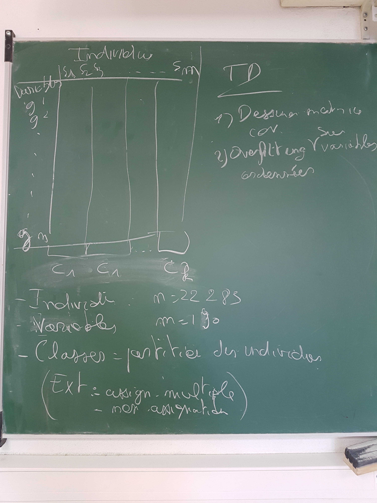
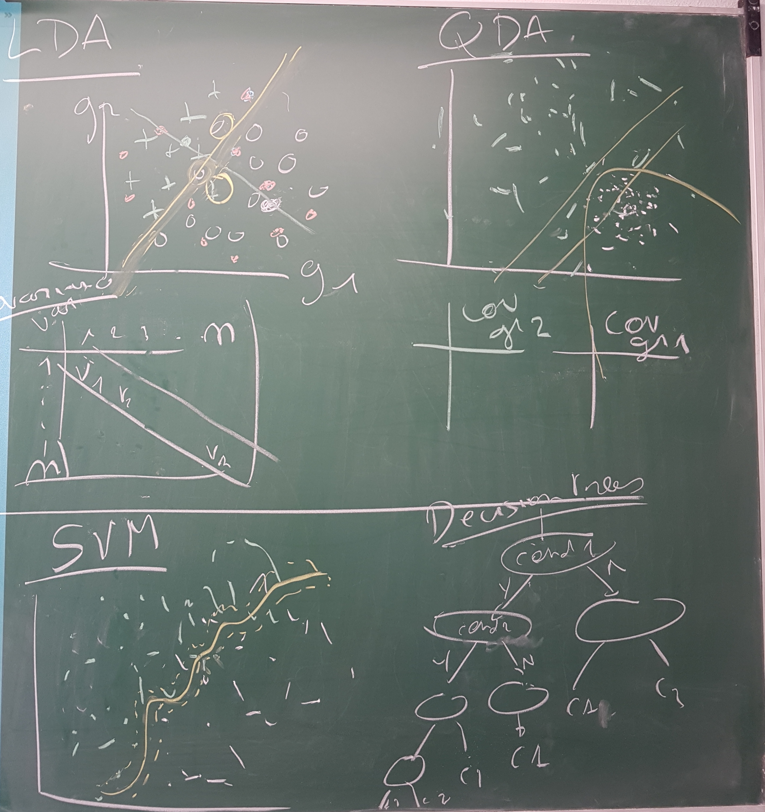

## Web site for this course

<https://dputhier.github.io/ASG/>

## Teachers

| Abbrev | Name  |
|----------|--------------------------------------------------|
| DP |  Denis Puthier |
| JvH | [Jacques van Helden](http://jacques.van-helden.perso.luminy.univ-amu.fr/) |
| | |

## Year

2017-2018

## Audience

- 2ème année du Master en Bioinformatique, biochimie structurale et génomique (BBSG).
- Ecole doctorale

<!--
## Travail personnel / Personal work

The instructions for the 2016 personal work can be found here

-  [html document (human-readable)](practicals/rnaseq_psoriasis_Li2014/RNA-seq_psoriasis_analysis_exercises.html)

- [Rmd (including code to load the data)](practicals/rnaseq_psoriasis_Li2014/RNA-seq_psoriasis_analysis_exercises.Rmd)

-->

## Resources

| Tool | About |
|---------------------------------------|---------------------------------------------------------------|
|[R](http://www.r-project.org/) |	A free software environment for statistical computing and graphics |
|[R markdown](http://rmarkdown.rstudio.com/) |	Documentation for R markdown language (used for the practicals) |
|[Bioconductor](http://www.bioconductor.org) |	A set of R libraries dedicated to statistical analysis of genomics data.|
| [MeV: MultiExperiment Viewer](http://www.tm4.org/) |	A Java application designed to allow the analysis of expression data |
|[Cluster 3.0](http://bonsai.hgc.jp/~mdehoon/software/cluster/software.htm) | Implements the most commonly used clustering methods for gene expression |
| [java Treeview](http://jtreeview.sourceforge.net) |	Java-based tool to visualize trees prodced by hierarchical clustering togeter with a heatmap with expression proviles.|

## Prerequisites

Students are expected to have followed the introduction to statistics in the first year of the master. 

- Probabilités et statistiques pour la biologie (SBBAU16L - STAT1): <https://jvanheld.github.io/stat1/>

We assume that the following concepts are acquired. 

- Discrete distributions (geometric, binomial)
- Sampling and estimation
- Mean comparison tests (Student, Welch)

A basic knowledge of the R language is expected. 

- handling of variables and data frames ("tables")
- distributions of probability
- drawing (histograms, dot plots)
- test of hypothesis

If you did not receive any training.

During the first practical we will briefly revise these concepts and practical skills. 

## Schedule and contents

| Date   | From | To   | Subject         | Teacher | Concepts   | Material            |
|-------|-----|-----|----------------|-----|----------------|-------------------------------------|
| 
| 3/11 | 14:00 | 18:00 | Introduction au cours | JvH | | Diapos [html](slides/01_introduction.html) [Rmd](slides/01_introduction.Rmd) |
| 3/11 6/11 | 14:00 | 18:00 | Detecting differentially expressed genes (DEG) with microrarrays | DP |- Hypothesis testing - Student $t$ statistics - Unbiased estimation of variance - MA plot - Volcano plots  -P-value distribution  - E-value| - **Slides:** [html](slides/Den_Boer_use_case/Den_Boer_use_case.html) [Rmd](slides/Den_Boer_use_case/Den_Boer_use_case.Rmd)   - **Basics about Student and Welch’s t test** [html](practicals/microarrays_student_test/Student_test_info.html) [Rmd](practicals/microarrays_student_test/Student_test_info.Rmd)   -  **Practical:** detecting differentially expressed genes in microarray data [html](practicals/microarrays_student_test/DenBoer_Student_test.html) [Rmd](practicals/microarrays_student_test/DenBoer_Student_test.Rmd)    -  **Practical:** generating random control sets following a Normal distribution (incomplete) [html](practicals/microarrays_student_test/negative_control_Welch-test.Rmd) [Rmd](practicals/microarrays_student_test/negative_control_Welch-test.Rmd)|
| 7/11 | 14:00  | 18:00 | About distances and clustering | DP | - Distance metrics   - Hierarchical clustering   | - Theory : [html](practicals/unsup_classif_slides/unsup_classification.pdf)  - Distance metrics and clustering (practical) [html](practicals/distances/distances.html) [rmd](practicals/distances/distances.Rmd) |
| 20/11 | 9:00 | 12:30 | The multiple ways to correct for multiple testing | JvH | - False positive risk (FPR)   - Expected number of false positives (E-value)   - Family-Wise Error Rate (FWER)   - False Discovery Rate (FDR) | - [Multiple testing corrections  (slides)](http://pedagogix-tagc.univ-mrs.fr/courses/ASG1/pdf_files/06.04.multitesting_corrections.pdf)   - [Multiple testing corrections (practical)](practicals/multiple_testing_td/multiple_testing_corrections.html) |
| 20/11 | 9:00 | 12:30 | Supervised classification  | JvH | - Discriminant analysis  - Cross-validation (k-fold, LOO)  - Data dimensionality and overfitting  - Variable selection | - [Introduction to multivariate analysis](pdf_files/07.00.multiv_intro.pdf)   - [Discriminant analysis (slides)](pdf_files/11.discriminant_analysis.pdf) - [Dimension reduction and PCA](pdf_files/10.visualization.pdf) - [Practical: supervised classification](practicals/supervised_classification_td/supervised_classification_td.html)  |
| 21/11 | 14:00  | 18:00 | Functional enrichment of DEG | DP | - Functional enrichment statistics   - The hypergeometric distribution   | - Theory : on white board   - [Hypergeometric distribution and enrichment statistics. An example application: DAVID (practical)](practicals/go_statistics_td/go_statistics_td_2015.html) |
| 22/11 | 14:00  | 18:00  | Overview of discrete distributions, with applications to NGS | DP | - Geometric - Binomial - Poisson -Hypergeometric - Negative binomial | Tutorial [[html](practicals/discrete_distributions_overview/discrete_distributions.html)][[pdf](practicals/discrete_distributions_overview/discrete_distributions.pdf)][[Rmd](practicals/discrete_distributions_overview/discrete_distributions.Rmd)] |
| 22/11  | 14:00 | 18:00 | Detecting differentially expressed genes (DEG) with RNA-seq | DP/JvH | - RNA-Seq principles  - Normalizing RNA-seq counts  -Detecting differentially expressed genes (DEG)| - RNA-Seq DEG with DESeq2 [[html]](practicals/rnaseq_diff_Snf2/rnaseq_diff_Snf2.html) [[pdf]](practicals/rnaseq_diff_Snf2/rnaseq_diff_Snf2.pdf) [[Rmd]](practicals/rnaseq_diff_Snf2/rnaseq_diff_Snf2.Rmd) |
| 22/11  | 14:00 | 18:00 | Descriptive statistics with ggplot2 | DP | - ggplot2 principles  - Layout, creating diagrams | - Introduction to ggplot2 [[html]](practicals/intro_ggplot/intro_ggplot.html) |
|  |  |  | RNA-seq analysis (pursued) | JvH | | [[]]() [[]]() |
|  |  |  | Preparation of the personal work | DP | **Homework: analysis of psoriasis data** [[html]](practicals/rnaseq_psoriasis_Li2014/RNA-seq_psoriasis_analysis_exercises.html) [[Rmd]](practicals/rnaseq_psoriasis_Li2014/RNA-seq_psoriasis_analysis_exercises.Rmd) [[bib]](practicals/rnaseq_psoriasis_Li2014/RNA-seq_psoriasis_analysis_biblio.bib)|

## Screen pictures

## Additional support

| Concept | Description |
|----------------|------------------------------------------------|
|Introduction to R | - [First steps with R and Siméon Denis Poisson  (practical)](http://jvanheld.github.io/EBA15_stats_RStudio/practicals/01_first_steps_with_R/01_first_steps_with_R.html)  - [R language: A quick tutorial (practical)](practicals/r_intro_td/index.html)  - [R language: A quick tutorial (practical)](practicals/r_intro_en/RQuickTutorial.pdf)|
|Occurrence statistics| - [The Poisson distribution in the context of Peak-calling (practical)](http://jvanheld.github.io/EBA15_stats_RStudio/practicals/02_peak-calling/peak-calling_stats_practical.html) - [The Poisson distribution in the context of k-mers occurence statistics (practical)](http://dputhier.github.io/STAT1_R/practical/R_intro.html)  - [Read mapping statistics and the binomial distribution (practical)](practicals/chip-seq_read_mapping/read_mapping_solutions.html)  - [Hypergeometric distribution and enrichment statistics. An example application: DAVID (practical)](practicals/go_statistics_td/go_statistics_td_2015.html)   - [Application example: K-mer occurrences in ChIP-seq peaks (practical)](http://pedagogix-tagc.univ-mrs.fr/courses/ASG1/practicals/kmer_occurrences/kmer_occurrences_chip-seq_peaks.html)|
|Microarray analysis | - [Introduction to multivariate analysis (slides)](pdf_files/07.00.multiv_intro.pdf)  - [Transcriptome microarrays: study cases (slides)](pdf_files/07.01.multiv_study_cases.pdf)  - [Normalization of Affymetrix DNA chip (slides)](practicals/affynorm_slides/index.html) -   - [Handling and normalizing affymetrix data with bioconductor (practical)](practicals/affynorm_td/index.html)   - [Differential_expression (slides)](pdf_files/07.04.differential_expression.pdf)   - [Basics about Student and Welch’s t test](practicals/microarrays_student_test/Student_test_info.html)   - [Microarray data: selecting differentially expressed genes with R or TmeV (practical)](practicals/affy_selection_td/affy_selection_td.html)   - [Sampling distributions (practical)](practicals/sampling_distrib.html) - [Detecting differentially expressed genes in microarray data. Part I: exploring Student t statistics](practicals/microarrays_student_test/DenBoer_Student_test.html)|
|The multiple ways to correct multiple testing| - [Multiple testing corrections  (slides)](http://pedagogix-tagc.univ-mrs.fr/courses/ASG1/pdf_files/06.04.multitesting_corrections.pdf)   - [Multiple testing corrections (practical)](practicals/multiple_testing_td/multiple_testing_corrections.html)|
|Clustering (unsupervised classification)| - [Correlation analysis (slides)](pdf_files/07.03.correlation_analysis.pdf)   - [Clustering (slides)](pdf_files/09.clustering.pdf)   - [Clustering (slides DP)](practicals/unsup_classif_slides/unsup_classification.pdf)  - [About distances](practicals/distances/distances.html)   - [Handling clustering methods: artificial datasets (practical)](unsup_classification_sim_td/index.html)   - [Clustering of microarray data](practicals/unsup_classification_td/index.html)|
|RNA-seq data analysis| - [RNA-Seq method (slides)](pdf_files/Rnaseq_2016.pdf)   - [RNA-seq read mapping (practical)](practicals/rnaseq_td/rnaseq_td.html)  - [The negative binomial and DESeq bioC package](practicals/rnaseq_diff/DESeqTuto.html)   - [The negative binomial and DESeq bioC package](practicals/rnaseq_diff/rnaseq_diff.html)|
|Supervised classification| - [Introduction to multivariate analysis](pdf_files/07.00.multiv_intro.pdf)   - [Discriminant analysis (slides)](pdf_files/11.discriminant_analysis.pdf)|
|Visualization| - [Dimension reduction and PCA](pdf_files/10.visualization.pdf)|
| Overview | - [Discrete distributions for NGS data analysis](practicals/discrete_distributions_overview/discrete_distributions.html)

## Personal work

The instructions for the 2017 personal work can be found here

-  [html document (human-readable)](practicals/recount/RNA-seq_recount_analysis_exercises.html)

- [Rmd](practicals/recount/RNA-seq_recount_analysis_exercises.Rmd)

